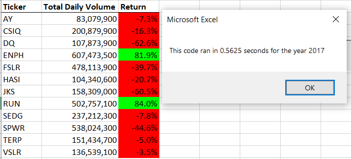
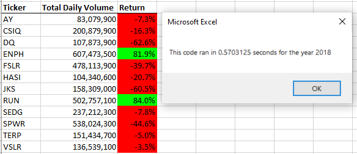
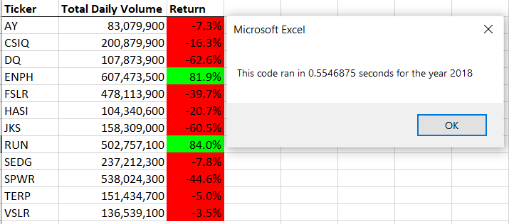

# VBA of Wall Street

## Overview of Project

### Purpose

The purpose of this project is to assist Steve in his mission to manage the stocks investments of his parents. They are passionate about green energy and want to invest in it, but have not conducted much research regarding which green energy stock to invest in. Steve has provided an excel file containing the stock data to be analyzed.

## Results 

### Results of Stock Performance between 2017 and 2018 

There is very minimal difference between the stock performance between 2017 and 2018. The percentages under the "Total Daily Volume" columns all look nearly identical.

 Additionally, there is very little difference between the execution times of the original script versus the refactored script, as shown on the images below.
#### Year 2017 (Original)

There is approximately a 0.0039 second difference between the original and refactored runtimes of the 2017 analysis.

#### Year 2017 (Refactored)

#### Year 2018 (Original)

There is approximately a 0.0156 second difference between the original and the refactored runtimes of the 2018 analysis.

#### Year 2018 (Refactored)

The difference in runtimes is miniscule between the original code and the refactored code.

## Summary

- What are the advantages or disadvanteges of refactoring code?  

One advantage of refacctoring code is that it cleans up the current code one may have written and thus made it easier for someone else to read through and understand what was done.  

Another advantage to refactoring is that it shortens the amount of time it takes the computer to process the code, thus making the coder overall more efficient.  

A disadvantage to refatoctoring code is that it is adds another step for the coder or team of coders to take. A certain sequence of code may be functional and to have to go back and refactor it may result in a large time commitment that is better off left alone.  

- How do these pros and cons apply to refactoring the original VBA script?

Due to the nature of the VBA language, it can be hard to understand what is going on in someone else's code, even when there are comments injected throughout. By refactoring one's code, one can not only make it easier to understand, but they also make the computer more able to compute the code. At the same time however, the process of refactoring takes time. If a code already works then perhaps there is no need to refactor.  
